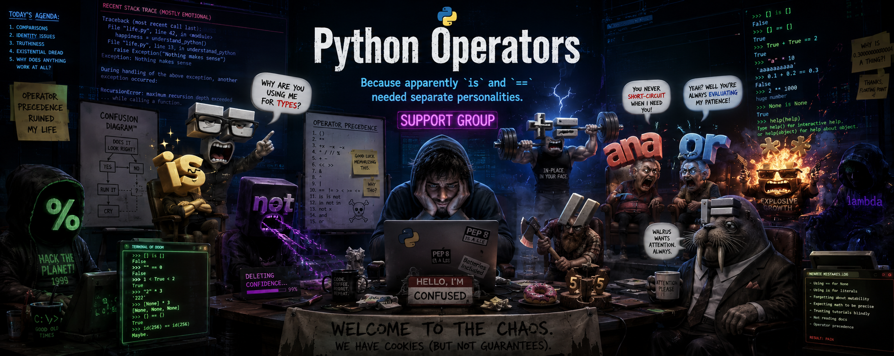

# Python Operators Reference




**🌐 Official Page: [unamatasanatarai.github.io/python-operators](https://unamatasanatarai.github.io/python-operators/)**

A lightweight, fast, and interactive educational reference for Python operators. This project provides a comprehensive guide to Python's operator landscape, featuring live search, category filtering, and executable code examples designed for both beginners and experienced developers.

## Features

- **Interactive Search**: Real-time filtering by symbol, name, or description.
- **Category Navigation**: Structured sidebar for browsing by operator types (Arithmetic, Logical, Bitwise, etc.).
- **Live Examples**: Syntax-highlighted code blocks with "Copy to Clipboard" functionality.
- **Adaptive Design**: Fully responsive layout with a dedicated mobile interface and persistent navigation.
- **Dark Mode**: High-contrast, "Pythonic" theme with persistent user preference using LocalStorage.
- **Discovery Tool**: Random operator selector to explore and learn new concepts.

## Tech Stack

- **Frontend**: Vanilla HTML5, CSS3, and JavaScript (ES6+).
- **Styling**: Pure CSS with a custom design system and glassmorphic header effects.
- **Typography**: Google Fonts (Inter for UI, JetBrains Mono for code).
- **Data**: JSON-driven operator database.

## Project Structure

- `index.html`: Semantic structure and layout containers.
- `styles.css`: Custom design system, responsive media queries, and theme tokens.
- `app.js`: Core engine for dynamic rendering, search logic, and state management.
- `table.json`: Structured source data for all operators and examples.

## Installation

No installation or build steps are required. This is a pure static site.

1. Clone the repository:
   ```bash
   git clone https://github.com/unamatasanatarai/python-operators.git
   ```
2. Open the project:
   - Simply open `index.html` in any modern web browser.
   - Alternatively, serve it using a local server:
     ```bash
     # Using Python
     python -m http.server 8000
     ```

## Usage

- **Search**: Use the top search bar to find specific operators. Press `/` as a keyboard shortcut to focus the input.
- **Filter**: Use the sidebar (on desktop) or the horizontal category bar (on mobile) to narrow down by operator type.
- **Copy**: Click the clipboard icon in any code block to quickly copy the example for use in your local environment.
- **Discovery**: Click the shuffle icon in the search bar to jump to a random operator card.

## License

This project is open-source and available under the [MIT License](LICENSE).
